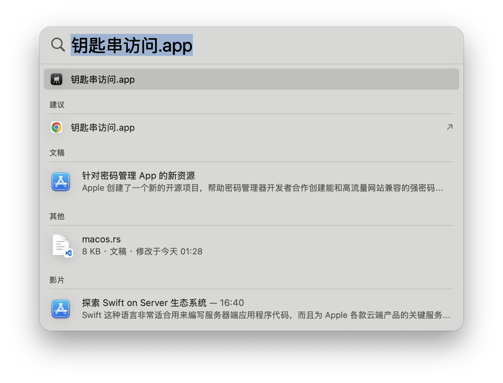
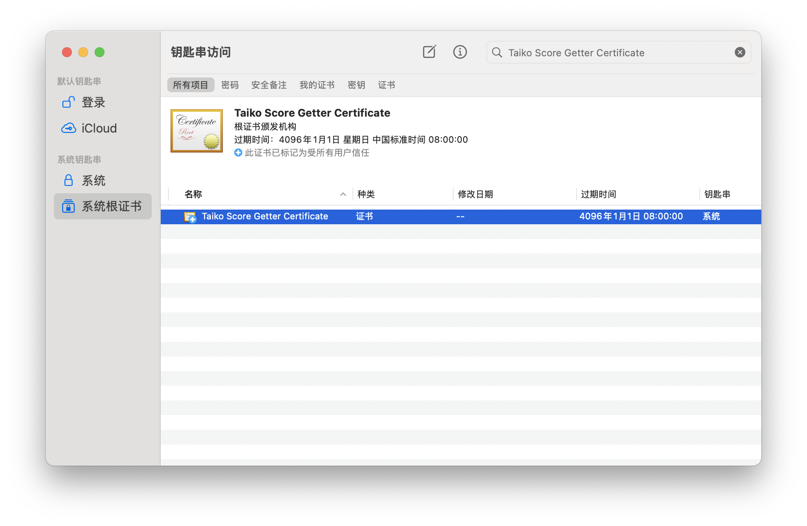
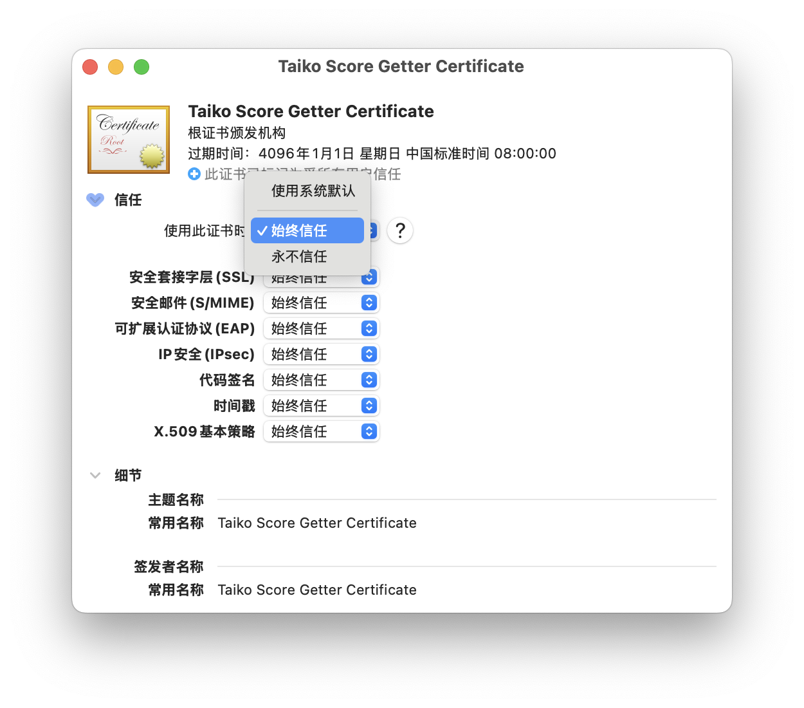

# macOS 证书安装的额外步骤

得益于 macOS 十分出众的安全机制，虽然本软件已经自动安装了证书，但是我们不得不在安装证书后手动信任证书才能正常使用它。

步骤如下：

- 按下 `Command + Space`，打开 Spotlight 搜索框
- 输入 `钥匙串访问`，打开钥匙串访问应用 
- 在 `钥匙串访问` 中，点击右上角的搜索框，输入 `Taiko Score Getter Certificate`，找到我们的证书 
- 双击证书，展开证书详情，并展开 `信任` 选项卡，将 `使用此证书时：` 的设置修改为 `始终信任` 后关闭窗口即可（修改后可能需要输入密码或使用 Touch ID 验证） 

